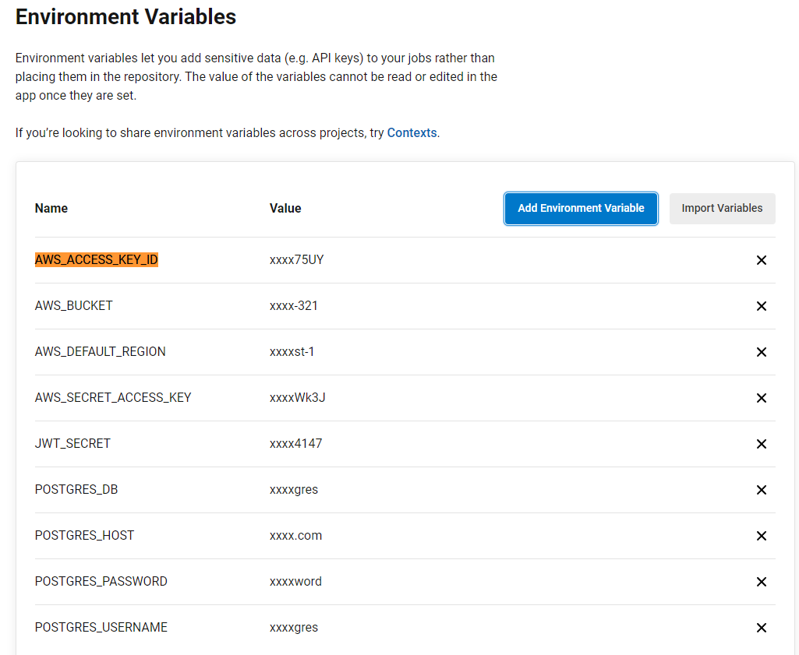

# Deploying a Full-Stack Application
---
#### This is a project used only demonstrating a CI/CD delivery to aws
---
### Dependencies

```
- Node v14.15.1 (LTS).
- npm 6.14.8 (LTS).
- AWS CLI v2.
- A RDS database running Postgres.
- A S3 bucket for hosting static files.
```
---
### Live applications
- Frontend files 

- Database configuration 

- API service 

- CircleCi integration 

- CircleCi environment variables    

---
## Testing

This project contains two different test suite: unit tests and End-To-End tests(e2e). Follow these steps to run the tests.

1. `cd starter/udagram-frontend`
1. `npm run test`
1. `npm run e2e`

There are no Unit test on the back-end

### Unit Tests:

Unit tests are using the Jasmine Framework.

### End to End Tests:

The e2e tests are using Protractor and Jasmine.

## Built With

- [Angular](https://angular.io/) - Single Page Application Framework
- [Node](https://nodejs.org) - Javascript Runtime
- [Express](https://expressjs.com/) - Javascript API Framework

## License

[License](LICENSE.txt)
