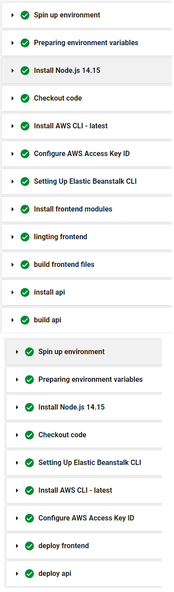

# Deploying a Full-Stack Application
---
#### This is a project used only demonstrating a CI/CD delivery to aws
---
#### **Live Application Links**
- [**API**](http://ududagramapi-env.eba-amz32irp.us-east-1.elasticbeanstalk.com/)
- [**Frontend**](http://udagram-frontend-321.s3-website-us-east-1.amazonaws.com)
### Dependencies
```
- Node v14.15.1 (LTS).
- npm 6.14.8 (LTS).
- AWS CLI v2.
- A RDS database running Postgres.
- A S3 bucket for hosting static files.
```
### Evironments
- Frontend
```
export const environment = {
  production: true,
  appName: 'Udagram',
  apiHost: 'http://ududagramapi-env.eba-amz32irp.us-east-1.elasticbeanstalk.com/api/v0'
};
```
- backend

---
### Screenshots
- Frontend files 

- Database configuration 

- API service 

- CircleCi integration 

- CircleCi environment variables    

- Beanstalk environment variables    

- High level diagram

- Pipeline workflow

- Pipeline jobs
