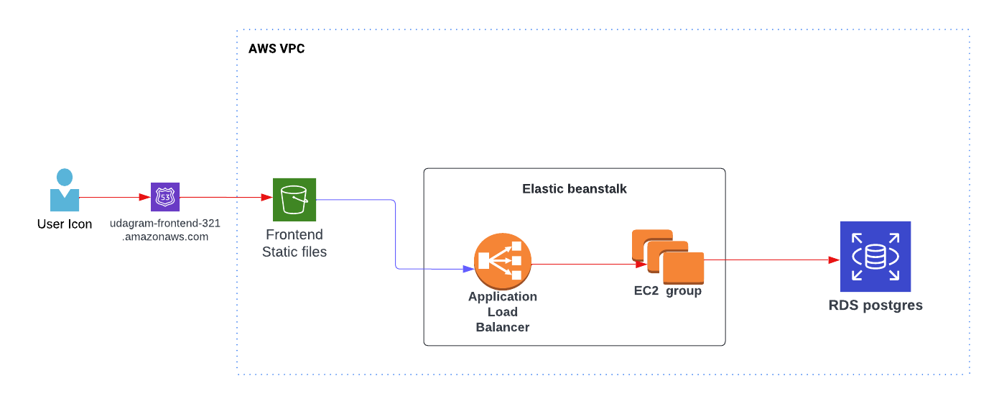

## Infrastructure

Resources used for hosting this Application :
- **AWS S3** for hosting frontend
- **AWS Beanstalk** for hosting the API
- **AWS RDS** for hosting the databse
- **CI/CD CircleCI** for running the pipeline
- **Github** for hosting the repository

---
### High level diagram

 