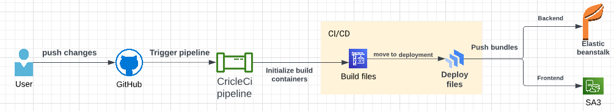

## Pipeline Process

```
Pipeline workflow :
- Initalize CI/CS containers
- Configure AWS CLI
- Configure AWS/EB CLI
- Install frontend modules 
- Lingting frontend
- Build frontend files
- Install API files
- Build API files
- Deploy Frontend to prod 
- Deploy API to prod
```
- Diagram

- Workflow

- Jobs sequence


 